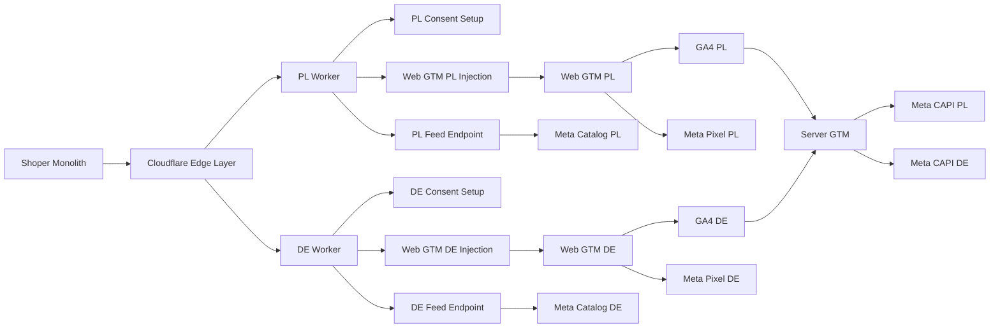
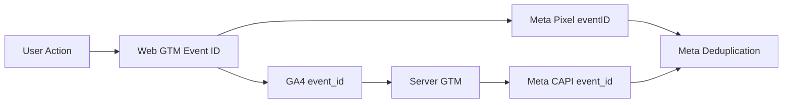

# Shoper Multi-Market Tracking Architecture

Technical case study based on a real e-commerce tracking infrastructure project for a Shoper-based store.

The goal was to separate analytics, advertising signals, consent management, product feed delivery and server-side tracking between different markets while keeping one monolithic Shoper store as the main e-commerce platform.

## Project Context

Shoper was used as the core e-commerce platform. It handled the product database, admin panel, storefront and backend infrastructure.

This setup was convenient for running one store, but created limitations for international expansion. The same platform instance supported multiple domains, languages and currencies, while the default tracking environment required additional customization for clean market separation.

Product feeds were generated on the Shoper side using product data managed inside the store and external feed applications.

The catalog itself remained based on Shoper product data, while feed separation was handled through Shoper-side multi-language and market configuration. Cloudflare was used as an additional delivery and control layer for exposing selected feed endpoints and keeping feed delivery aligned with the tracking architecture.

Main challenges:

- Polish and German traffic could be mixed in one analytics setup.
- Google Ads and Meta Ads could receive combined signals from different markets.
- Product feeds required separation by language, currency and delivery logic.
- Consent and tag management needed to work correctly per domain.
- Meta Pixel and Meta CAPI events had to stay consistent for deduplication.
- Server-side tracking required infrastructure outside the Shoper backend.

## High-Level Architecture



## Solution Overview

The solution used several layers outside the Shoper backend.

The first separation layer was implemented at the Cloudflare edge. Different Cloudflare Worker logic was used for different domains and markets. This allowed the setup to inject market-specific consent and GTM configuration, expose selected feed endpoints and control tracking behavior before traffic reached the storefront or analytics tools.

Main solution layers:

- Cloudflare Workers for domain-level separation, HTML rewriting, consent injection, GTM injection, tracking cleanup and controlled feed delivery.
- Web GTM containers for browser-side ecommerce tracking, Meta Pixel events and event ID generation.
- Server-side GTM for routing GA4 events to server-side destinations.
- Meta CAPI for server-side conversion tracking.
- Google Cloud Run as the runtime layer for the server-side GTM container.
- Separate tracking logic for PL and DE markets.

## Architecture Layers

### 1. Shoper Platform

Shoper worked as the monolithic e-commerce layer:

- product database,
- admin panel,
- storefront,
- backend infrastructure,
- product feed source through external feed applications.

The platform provided the store foundation, but additional tracking infrastructure was needed to separate markets properly.

### 2. Cloudflare Edge Layer

Cloudflare was used as the first separation layer in front of the storefront.

Instead of relying only on the platform's built-in tracking setup, Cloudflare Workers controlled how each market received its tracking and consent configuration.

Main responsibilities:

- separating PL and DE domains at the edge,
- injecting market-specific GTM containers,
- injecting market-specific consent and Cookiebot setup,
- removing or blocking unwanted legacy tracking snippets,
- filtering incorrect GA4 requests,
- exposing selected market-specific feed endpoints,
- supporting tracking governance before requests reached analytics tools.

Product feed generation itself stayed on the Shoper side. Feed applications used product data managed inside Shoper and generated market-specific XML feeds. Cloudflare was used to proxy or expose selected feed endpoints, not to create the catalog or rebuild feed logic from scratch.

### 3. Web GTM Layer

Web GTM handled browser-side tracking logic after the correct market-specific setup was injected by Cloudflare.

Main responsibilities:

- ecommerce event mapping,
- GA4 ecommerce events,
- Meta Pixel browser events,
- event ID generation for deduplication,
- user data mapping,
- consent-based tag firing,
- separate PL and DE tracking setups.

### 4. Server-side GTM Layer

Server-side GTM worked as a routing and validation layer between Web GTM and server-side destinations.

Main responsibilities:

- receiving GA4 events from Web GTM,
- reading `event_id` from incoming event data,
- preserving `event_id` for Meta CAPI deduplication,
- separating PL and DE tracking flows,
- routing events to the correct GA4 and Meta CAPI setup,
- blocking unwanted or low-value events,
- preventing CAPI forwarding without a valid deduplication ID.

### 5. Google Cloud Run

Google Cloud Run was used as the runtime environment for the server-side GTM container.

Its role was to host the server container and expose custom tagging endpoints for server-side tracking.

```text
Browser
→ Cloudflare Worker
→ Market-specific Web GTM
→ GA4 request with event_id
→ Custom CAPI domain
→ Google Cloud Run
→ Server-side GTM
→ Meta CAPI and GA4 routing
```

## Meta CAPI Deduplication Flow

The browser and server-side events used the same event identifier.



This allowed Meta to match browser-side Pixel events with server-side CAPI events and avoid duplicate conversion reporting.

## Repository Structure

```text
shoper-multi-market-tracking-architecture
├── README.md
├── diagrams
│   ├── architecture.mmd
│   └── meta-capi-deduplication.mmd
├── docs
│   ├── cloudflare-layer.md
│   ├── sgtm-layer.md
│   ├── shoper-limitations.md
│   └── web-gtm-layer.md
└── examples
    ├── event-id-generation.js
    └── tracking-flow-example.json
```

## Included Examples

This repository includes simplified examples and documentation for:

- Cloudflare-based market separation
- Web GTM ecommerce event flow
- Meta event ID generation
- Server-side GTM routing logic
- Meta CAPI deduplication flow
- Shoper tracking limitations

## Related Repositories

- `cloudflare-ecommerce-tracking-infrastructure` — Cloudflare Worker examples for tracking control, feed endpoint proxying and HTML rewriting.
- `ecommerce-json-to-html-data-converter` — Product data conversion script for ecommerce catalog migration.

## Technologies

- Shoper
- Cloudflare Workers
- Google Tag Manager
- Server-side Google Tag Manager
- Google Analytics 4
- Meta Pixel
- Meta Conversions API
- Cookiebot
- Google Consent Mode
- Google Cloud Run
- XML product feeds

## Disclaimer

This repository contains a generalized and sanitized architecture description.

Production identifiers, domains, access tokens, tracking IDs, business data and client-specific configurations have been removed or replaced with placeholders.

This case study describes platform constraints and tracking architecture decisions in a multi-market e-commerce setup. It does not describe a security vulnerability, exploit, unauthorized access method or confidential platform issue.
